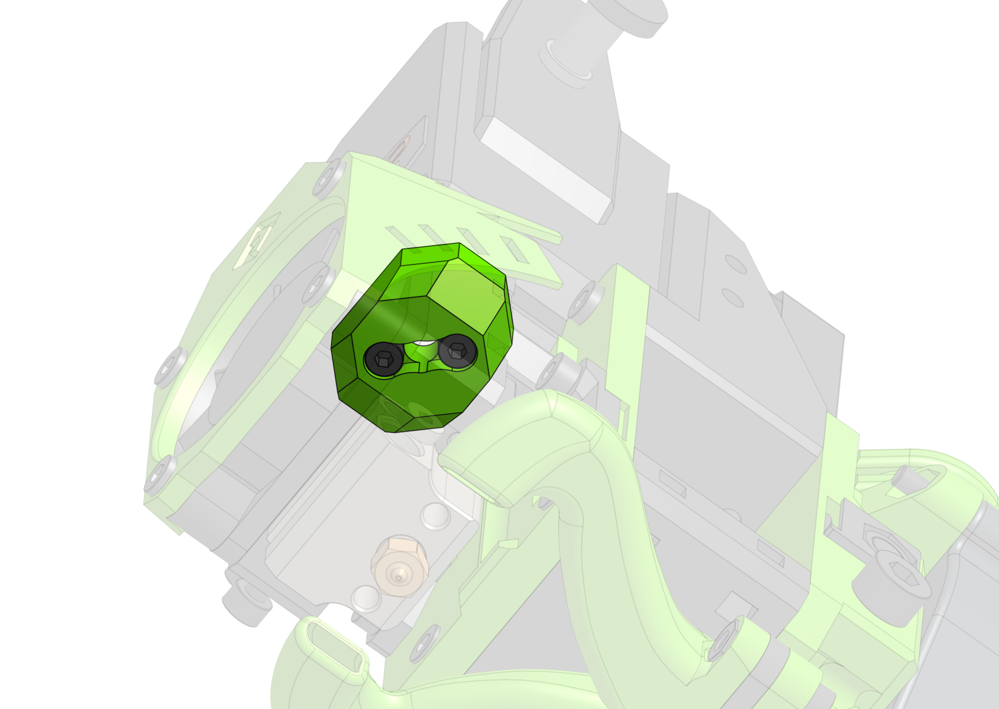

---
badges:
    - Official
---
# BMG

This one is one of my favourites, like the Titan one the filament path is not super short but that's an exchange for the modularity EVA provides, also it does not seem to make much difference. EVA 2 / BMG is compatible with both the standard BMG and BMG-M for all hotend options.  
I'm personally using this EVA drive variant.

??? tip "BMG-M users - please read"

    Since EVA 2.1.0 the direct interface between the hotend and the extruder is removed, that means there's nothing holding the PTFE tube in place on top. To alleviate that a `bmg-m_pfte_adapter` part was made which is screwed into the BMG-M that will hold the tube in place.

    The part is available in the Mosquito BOM bellow.

    

### Links

{{ eva_download_button("bmg") }}

{{ eva_link("bmg") }}

{{ onshape_link("bmg") }}

### BOM

=== "E3D V6"

    This BOM assumes a regular BMG, for BMG-M the `bmg-m_pfte_adapter` part and a shorter PTFE tube is needed.

{{ bom("drives/bmg/bom/v6.csv", 4) }}

=== "Mosquito"

    This BOM assumes a BMG-M, for a regular BMG you don't need the `bmg-m_pfte_adapter` part but will need a longer PTFE tube.

{{ bom("drives/bmg/bom/mosquito.csv", 4) }}

=== "Dragon"

    This BOM assumes a regular BMG, for BMG-M the `bmg-m_pfte_adapter` part and a shorter PTFE tube is needed.

{{ bom("drives/bmg/bom/dragon.csv", 4) }}
