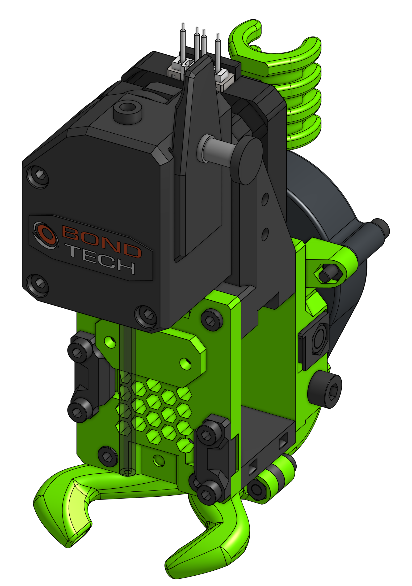

# BMG

This one is one of my favourites, like the Titan one the filament path is not super short but that's an exchange for the modularity EVA provides, also it does not seem to make much difference. EVA 2 / BMG is compatible with both the standard BMG and BMG-M for all hotend options.  
I'm personally using this EVA drive variant.

!!! info "Universal EVA Front"

    This drive uses the universal face, which means it's comatible with all hotends you can find in the Hotends section.

??? tip "BMG-M users - please read"

    Since EVA 2.1.0 the direct interface between the hotend and the extruder is removed, that means there's nothing holding the PTFE tube in place on top. To alleviate that a `bmg-m_pfte_adapter` part was made which is screwed into the BMG-M that will hold the tube in place.

    This assembly requires two `M2.5 10mm screws` and the [`bmg-m_pfte_adapter`](extra_stls/bmg-m_pfte_adapter.stl) part.

    

### Bill of materials

=== "MGN12"

    <add-bom-button name="{{ meta.uid }} (MGN12)">
        {{ bom_to_json("BMG.MGN12.csv") }}
    </add-bom-button>
    
    {{ bom_to_md_table("BMG.MGN12.csv", 4) }}

=== "MGN15"

    <add-bom-button name="{{ meta.uid }} (MGN15)">
        {{ bom_to_json("BMG.MGN15.csv") }}
    </add-bom-button>
    
    {{ bom_to_md_table("BMG.MGN15.csv", 4) }}

#### PTFE Tube lenghts

| Hotend | Length |
| ------ | ------ |
| Mosquito | 45.5 mm |
| E3D V6 | 62 mm |
| Dragon | 47 mm |
| Copperhead | 61 mm |

### Links

{{ download_button }}
{{ cad_link }}

